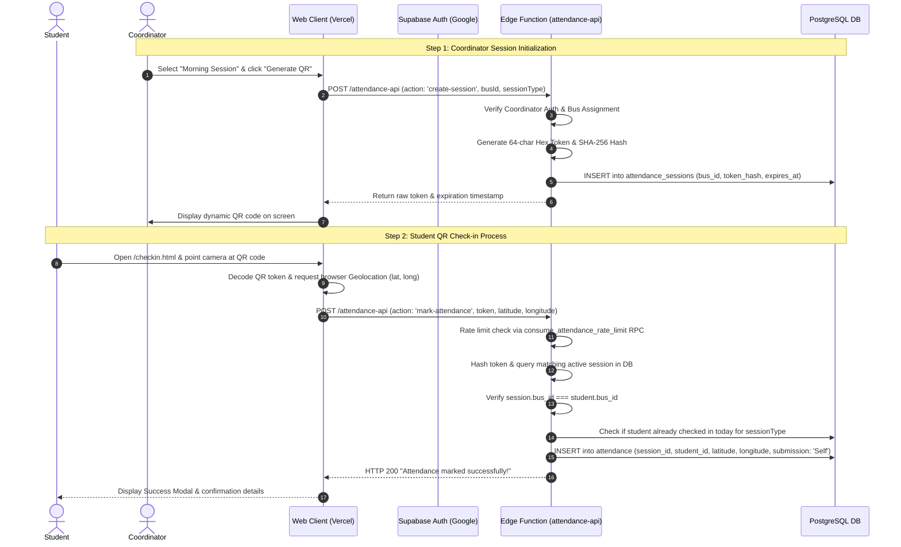
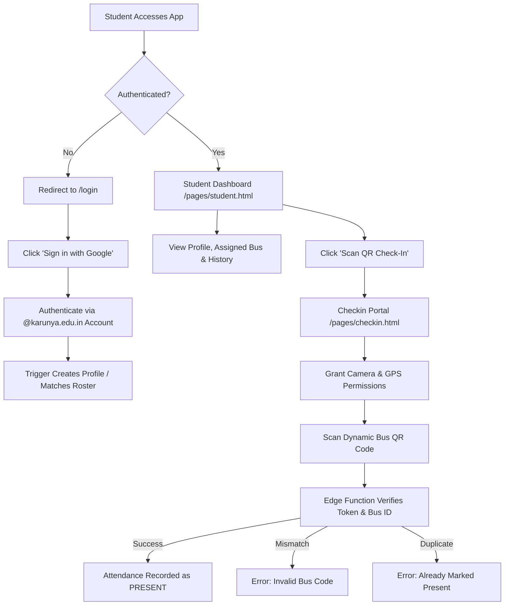
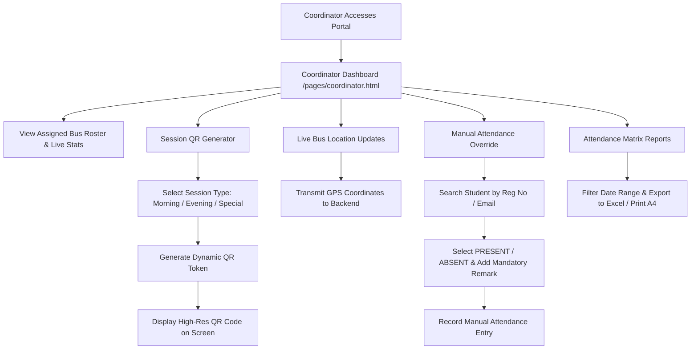
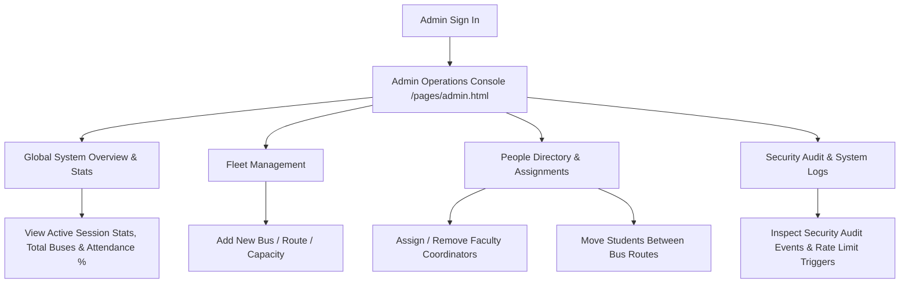

# Karunya Bus Attendance Management System — User Use Case Flows

**Document Version**: 1.0.0  
**Target Audience**: Product Managers, Software Engineers, Quality Assurance, System Operations  
**Classification**: System Flow & Persona Specification  

---

## 1. Persona Definitions

The platform serves three primary user personas with strictly scoped role-based access control (RBAC):

1. **Student Persona**: Karunya Institute students enrolled in university bus transit.
2. **Bus Coordinator Persona**: Designated faculty or staff members operating on-board bus routes.
3. **Administrator Persona**: System admins overseeing fleet management, user assignments, security audit logs, and global analytics.

---

## 2. End-to-End Sequence Diagrams

### 2.1 Complete Attendance Lifecycle Flow

---

## 3. Persona 1: Student User Journey

### Step-by-Step Flow Details

#### Flow ST-1: Authentication & Onboarding
1. Student navigates to the portal root (`/`).
2. Clicks **Sign in with Google**.
3. Selects official `@karunya.edu.in` Google account.
4. Database trigger [`create_profile_after_signup`](file:///home/benesha/ewyl/bus/Karunya_vehicle/supabase/migrations/20260802131816_initial_bus_attendance_schema.sql#L29-L30) intercepts creation:
   - Validates `@karunya.edu.in` domain.
   - Sets default role to `student`.
   - Derives registration number from email prefix (e.g., `URK23CS1001@karunya.edu.in` $\rightarrow$ `URK23CS1001`).
   - Syncs bus assignment from pre-assigned roster (`pending_student_assignments`).

#### Flow ST-2: Dynamic QR Attendance Check-In
1. On-board bus, student opens `/pages/checkin.html`.
2. Clicks **Scan QR with Camera**. Browser invokes native `BarcodeDetector` (or `jsQR` fallback).
3. Student scans dynamic QR code presented by Coordinator.
4. App prompts for Geolocation permissions. Student grants high-accuracy GPS access.
5. Client posts payload to Edge Function `attendance-api` (`action: 'mark-attendance'`).
6. **Edge Function Validations**:
   - Checks rate-limit status.
   - Computes SHA-256 digest of scanned token.
   - Validates unexpired session matching student's assigned `bus_id`.
   - Prevents duplicate check-ins for the same session type on the same calendar day.
7. Upon successful validation, app renders green confirmation modal and plays confirmation toast notification.

#### Flow ST-3: Attendance History Review
1. Student clicks **Attendance History** on dashboard.
2. Client invokes `student_attendance_history` RPC.
3. Renders timestamped list of verified bus check-ins with session type (*Morning/Evening/Special*), bus number, and verification badge.

---

## 4. Persona 2: Bus Coordinator User Journey

### Step-by-Step Flow Details

#### Flow CO-1: Dynamic Session Generation
1. Coordinator logs in and lands on `/pages/coordinator.html`.
2. System loads assigned bus details (e.g., *Bus 01 - City Route*).
3. Selects session type (*Morning*, *Evening*, or *Special*).
4. Clicks **Generate Attendance QR**.
5. Edge Function returns ephemeral token; dashboard displays live QR code on screen for students to scan.

#### Flow CO-2: Live Fleet Positioning
1. Dashboard initiates background location sync.
2. Sends GPS coordinates via `update-coordinator-location` action.
3. Bus latitude/longitude updated in real-time for fleet map rendering.

#### Flow CO-3: Manual Attendance Override
1. Used when a student lacks a smartphone, battery died, or experienced GPS hardware failure.
2. Coordinator enters student Register Number or Email.
3. Selects status (**PRESENT** or **ABSENT**) and session type.
4. Enters **Mandatory Reason/Remark** (3–250 characters, e.g., *"Phone battery discharged on-board"*).
5. Edge Function records manual override entry with `submission: 'Manual'`.

#### Flow CO-4: Reports & Excel Export
1. Navigates to **Reports** tab.
2. Selects Date Range (e.g., `2026-08-01` to `2026-08-21`).
3. System aggregates attendance matrix across all active bus days (skipping non-operational Sundays).
4. Coordinator clicks **Export Excel (.xlsx)** to download styled matrix file with percentage summaries, or **Print Report** for landscape A4 layout.

---

## 5. Persona 3: Administrator User Journey

### Step-by-Step Flow Details

#### Flow AD-1: Fleet & Bus Route Setup
1. Admin opens `/pages/admin.html`.
2. Clicks **Add New Bus**.
3. Inputs Bus Number (e.g., `13`), Route Description (*"Coimbatore Express Route"*), and Seating Capacity (`60`).
4. Edge Function validates bus number uniqueness and creates bus record.

#### Flow AD-2: Student Bus Reassignment
1. Admin searches student email/register number in Directory.
2. Selects **Move to New Bus**.
3. Chooses Target Bus ID.
4. Edge Function executes atomic update on both `profiles` and `pending_student_assignments` tables.

#### Flow AD-3: Coordinator Assignment
1. Admin selects **Add Bus Coordinator**.
2. Inputs faculty email (e.g., `titusi@karunya.edu`), full name, and target Bus ID.
3. Edge Function promotes user role to `coordinator` and binds `bus_id`.

#### Flow AD-4: Audit & Security Logging
1. Admin views **Security Audit Panel**.
2. System displays recent events from `security_audit_events` (denied access attempts, rate-limited requests, manual overrides).

---

## 6. Exception & Edge-Case Matrix

| Scenario | Trigger Condition | System Behavior & User Feedback |
| :--- | :--- | :--- |
| **Wrong Bus Scan** | Student on Bus 1 scans QR code for Bus 2 | Edge Function rejects check-in. Displays: `HTTP 400: STUDENT BELONG TO THIS BUS INVALID SCAN YOUR BUS CODE`. |
| **Duplicate Scan** | Student scans QR twice in same session | Edge Function rejects check-in. Displays: `HTTP 409: ALREADY MARKED PRESENT !!!`. |
| **Expired QR Code** | Student scans QR after session timeout (> 5 hours) | Edge Function rejects request. Displays: `HTTP 400: Invalid or expired QR session.`. |
| **Camera Permission Denied** | Device blocks camera access | Scanner prompts fallback to manual token input or URL token parameter. |
| **GPS Geolocation Denied** | Student blocks browser location access | Check-in blocked. Displays toast: `"Location permission is required to mark attendance."`. |
| **Rate Limit Exceeded** | User spams check-in requests | Edge Function responds `HTTP 429 Too Many Requests`. Re-try countdown displayed. |
| **Non-Karunya Account** | User signs in with `@gmail.com` | Database trigger & Edge Function block signup/access. Displays: `"Only official Karunya accounts are authorized."`. |
